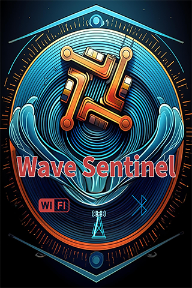

<p align="center">
  
</p>

<h1 align="center">WaveSentinel</h1>

<p align="center">
  <strong>Sub-GHz &middot; IR &middot; WiFi &middot; Bluetooth Testing Tool</strong><br>
  ESP32-S3 + WT32-SC01-PLUS + CC1101 + IR LED
</p>

<p align="center">
  <a href="https://ozinfl.github.io/WaveSentinel-refactored2/">
    
  </a>
</p>

---

## Web Installer

Flash WaveSentinel directly from your browser — no tools required.

**[Launch Web Flasher](https://ozinfl.github.io/WaveSentinel-refactored2/)**

> Requires **Chrome** or **Edge** on desktop. Connect your WT32-SC01-PLUS via USB, click Install, and select the serial port.

---

## Features

### Sub-GHz RF (CC1101)
- **Capture & Playback** — Record and retransmit RF signals (300-928 MHz)
- **Frequency Scanner** — Sweep and detect active frequencies
- **Protocol Analyzer** — Real-time identification: Princeton, KeeLoq, CAME, Nice FLO, GateTX, Linear, and more
- **Signal Generator** — Transmit on configurable frequency, modulation, and data rate
- **Flipper .sub Compatible** — Load, save, and play Flipper Zero sub-files from SD card
- **Tesla Charge Port** — US and EU signal emulation
- **RCSwitch Types A–D** — DIP switch, rotary/sliding, Intertechno, and REV remote control transmit
- **RAW TX** — Send raw codes with configurable frequency, bit length, pulse length, protocol, and repeat count
- **TouchTunes Remote** — Wireless jukebox control with full command set
- **Universal Remote** — 35-button programmable remote (Numbers, Nav, Media tabs). Assign any .sub (RF) or .ir (IR) file to any button, save/load profiles to SD card. Brand browser with category/brand/file/signal dropdowns for Flipper-IRDB files
- **Full CC1101 Config** — Frequency, modulation, bandwidth, deviation, data rate, TX power, sync mode, packet format

### Infrared (IR)
- **IR Transmit** — Send IR signals via LED on GPIO 21 (NEC, Samsung, Sony, RC5, RC6, Panasonic, LG, JVC, Sharp + raw)
- **Flipper .ir Compatible** — Load and transmit Flipper Zero IR files from SD card (parsed and raw signal types)
- **Brand Browser** — Navigate IR files by category and brand (e.g., TVs → Samsung → Power). Supports Flipper-IRDB folder structure

### WiFi
- **Network Scanner** — Scan and inspect nearby access points
- **WiFi Join** — Connect to networks with on-screen QWERTY keyboard, credentials saved to NVS
- **Beacon Flood** — Broadcast fake SSIDs (random, rickroll, funny names)
- **Deauth** — 802.11 deauthentication frame testing
- **Packet Sniffer** — Promiscuous mode with packet stats and probe request capture
- **OTA Updates** — Over-the-air firmware updates via built-in web server

### Bluetooth Low Energy
- **BLE Spam** — Advertisement flooding (Apple, Android, Samsung, Windows, Google)
- **BLE Scanner** — Discover nearby BLE devices with name, MAC, and RSSI

### Hardware & UI
- **3.5" Capacitive Touchscreen** — Full touch-driven LVGL interface, no buttons needed
- **Status Bar** — Persistent WiFi and battery icons across all screens
- **SD Card** — Save/load captures, presets, remote profiles, and Flipper .sub files
- **I2S Audio** — Sound output via DAC
- **TouchTunes Remote** — Wireless jukebox control with full command set

---

## Hardware

| Component | Details |
|-----------|---------|
| **MCU** | ESP32-S3 @ 240 MHz (Dual-Core Xtensa LX7) |
| **Display** | WT32-SC01-PLUS — 3.5" 480x320 ST7796 IPS |
| **Touch** | FT5x06 Capacitive |
| **RF** | CC1101 (300-928 MHz) on SPI |
| **IR** | IR LED on GPIO 21 |
| **Memory** | 8 MB PSRAM + 16 MB Flash |
| **Storage** | microSD via dedicated SPI bus |
| **Audio** | I2S DAC (GPIO 36/35/37) |
| **Wireless** | WiFi 802.11 b/g/n + BLE 5.0 |
| **Power** | USB-C + LiPo battery |

### Pin Mapping

```
CC1101:  MISO=11  MOSI=10  SCLK=14  CS=12  GDO0=13   (SPI2/FSPI)
SD Card: MISO=38  MOSI=40  SCLK=39  CS=41             (SPI3/HSPI)
IR LED:  GPIO=21
I2S:     BCLK=36  LRC=35   DOUT=37
Display: 8-bit parallel bus  RST=4  BL=45
Touch:   SDA=6  SCL=5  INT=7  (I2C @ 0x38)
```

---

## Building from Source

### Prerequisites
- [PlatformIO](https://platformio.org/) (CLI or VS Code extension)
- USB-C cable

### Build & Flash

```bash
# Clone
git clone https://github.com/OzInFl/WaveSentinel-refactored2.git
cd WaveSentinel-refactored2

# Build
pio run

# Flash via USB
pio run --target upload
```

### Firmware Architecture

```
Core 0: LVGL display refresh (5ms timer)
Core 1: Main loop state machine — RF, WiFi, BLE operations
```

All LVGL calls from Core 1 are protected by a FreeRTOS mutex. The state machine in `main.cpp` drives 24 operational states across RF capture/playback, IR transmit, WiFi scanning/attack, BLE operations, universal remote, and more.

---

## Tech Stack

| Layer | Technology |
|-------|-----------|
| Framework | Arduino + ESP-IDF (PlatformIO) |
| Display | LovyanGFX + LVGL 8.3 |
| RF | ELECHOUSE CC1101 + RCSwitch |
| IR | IRremoteESP8266 (GPIO 21 via RMT) |
| BLE | NimBLE-Arduino |
| WiFi | ESP-IDF WiFi (promiscuous + raw TX) |
| Storage | SD (SPI) + NVS Preferences |

---

## License

For educational and authorized security research purposes only.

---

<p align="center">
  <sub>Built with ESP-IDF + Arduino + LVGL + LovyanGFX</sub>
</p>
